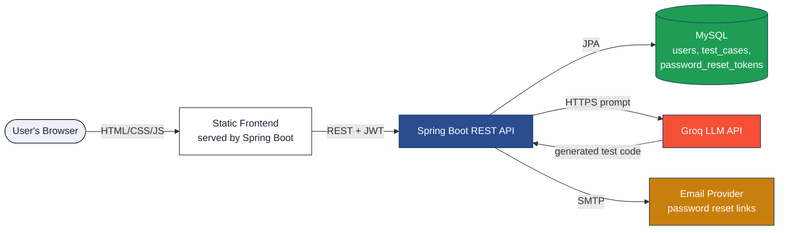
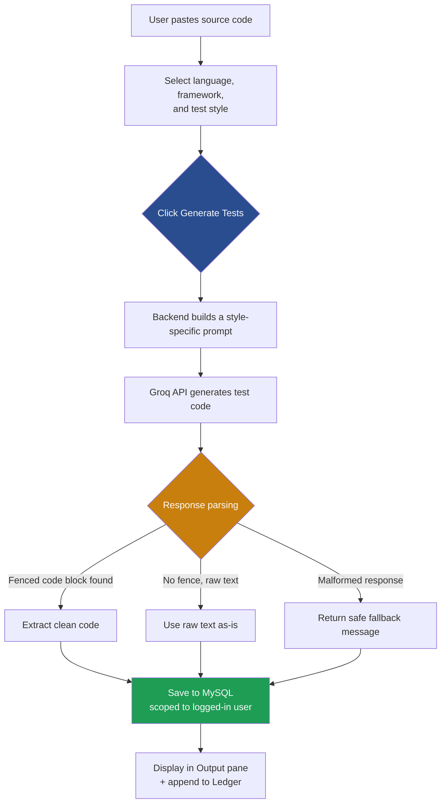
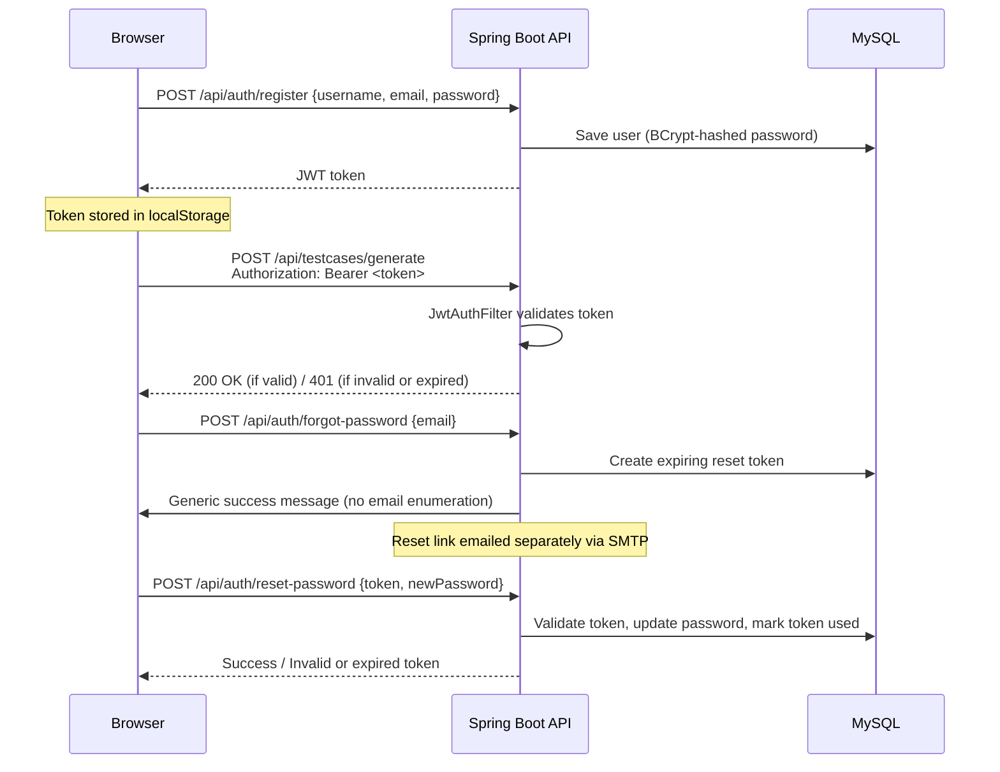

<div align="center">

# TestLedger

### AI-Powered Unit Test Generator

Paste source code in, get compilable unit tests out — powered by LLM reasoning, backed by MySQL, secured with JWT auth.

[](https://openjdk.org/)
[](https://spring.io/projects/spring-boot)
[](https://www.mysql.com/)
[](https://groq.com/)
[](https://jwt.io/)
[](#license)

[Overview](#overview) • [Features](#features) • [Architecture](#architecture) • [Getting Started](#getting-started) • [API Reference](#api-reference) 

</div>

---

## Overview

**TestLedger** is a full-stack web application that uses LLM-based reasoning (via the **Groq API**) to automatically generate unit test cases from source code. Every generated test case is persisted to **MySQL** for tracking and reuse, and access is secured with **JWT-based authentication** so each user has their own private test history.

Built as an end-to-end demonstration of combining traditional backend engineering (Spring Boot, JPA, MySQL, Spring Security) with practical LLM integration (prompt engineering, response parsing, fallback handling).

---

## Features

| Category | Feature | Description |
|---|---|---|
| **Core** | LLM-powered generation | Paste any class/function, get complete, compilable unit tests back |
| **Core** | Multiple test styles | Choose Happy Path, Exhaustive Edge Cases, Boundary Values, or Comprehensive |
| **Core** | Multi-language support | Java, Python, JavaScript, C# — with matching frameworks (JUnit 5, pytest, Jest, NUnit, Mockito) |
| **Core** | Persistent ledger | Every generated test is saved to MySQL with source code, timestamp, and metadata |
| **Auth** | Register / Login / Logout | Stateless JWT authentication, BCrypt-hashed passwords |
| **Auth** | Per-user data isolation | Each user's ledger only shows their own generated test cases |
| **UX** | Searchable history | Filter past generations by class name in real time |
| **UX** | Copy / Download | Export generated tests as a ready-to-paste file |
| **Resilience** | 3-layer response parsing | Fenced code block → raw text → safe fallback, so inconsistent LLM formatting never breaks the app |
| **Resilience** | Graceful failure handling | Clear error banners instead of silent failures or crashes |

---

## Tech Stack

| Layer | Technology |
|---|---|
| Backend | Java 17, Spring Boot 3.3 (Web, Data JPA, Validation, Security) |
| Database | MySQL 8.x |
| Auth | Spring Security + JJWT (JSON Web Tokens), BCrypt |
| LLM | Groq API — OpenAI-compatible chat completions (`llama-3.3-70b-versatile`) |
| Frontend | HTML5, CSS3, vanilla JavaScript (no framework) |
| Build | Maven |


---

## Architecture

### System overview



### Test generation flow



### Authentication flow



---

## Project Structure

```
unit-test-generator/
├── pom.xml
├── sql/
│   └── schema.sql
├── src/main/java/com/testgen/
│   ├── TestGenApplication.java
│   ├── config/
│   │   └── AppConfig.java                # RestTemplate + CORS
│   ├── security/
│   │   ├── JwtUtil.java                  # token generation/validation
│   │   ├── JwtAuthFilter.java            # request-level auth filter
│   │   └── SecurityConfig.java           # route protection rules
│   ├── controller/
│   │   ├── AuthController.java           # register/login/logout/reset
│   │   ├── TestCaseController.java       # generate/list/search/delete
│   │   └── GlobalExceptionHandler.java
│   ├── service/
│   │   ├── AuthService.java
│   │   ├── EmailService.java            # password reset emails
│   │   ├── GroqService.java              # LLM prompt + response parsing
│   │   ├── TestCaseService.java          # business logic + persistence
│   │   └── UserDetailsServiceImpl.java
│   ├── repository/
│   │   ├── UserRepository.java
│   │   ├── TestCaseRepository.java
│   │   └── PasswordResetTokenRepository.java
│   ├── model/
│   │   ├── User.java
│   │   ├── TestCase.java
│   │   └── PasswordResetToken.java
│   └── dto/
│       ├── RegisterRequest.java / LoginRequest.java
│       ├── ForgotPasswordRequest.java / ResetPasswordRequest.java
│       └── GenerateRequest.java / GenerateResponse.java / AuthResponse.java
└── src/main/resources/
    ├── application.properties
    └── static/
        ├── index.html / style.css / script.js       # main app
        ├── login.html / register.html / auth.js      # authentication
        └── forgot-password.html / reset-password.html
```

---

## Getting Started

### Prerequisites

| Requirement | Version |
|---|---|
| Java (JDK) | 17+ |
| Maven | 3.8+ |
| MySQL | 8.x |
| Groq API key | Free at [console.groq.com](https://console.groq.com) |
| SMTP account (optional) | For password reset emails, e.g. Gmail with an App Password |

### Installation

```bash
git clone https://github.com/<your-username>/unit-test-generator.git
cd unit-test-generator

# Create the database (Hibernate will auto-create the tables)
mysql -u root -p -e "CREATE DATABASE testgen_db;"

# Set required environment variables
export GROQ_API_KEY=gsk_your_key_here
export DB_USERNAME=root
export DB_PASSWORD=your_mysql_password
export MAIL_USERNAME=your_email@gmail.com     # optional, for password reset
export MAIL_PASSWORD=your_app_password         # optional
export JWT_SECRET=a-random-string-32-chars-or-longer

mvn clean install
mvn spring-boot:run
```

Open **http://localhost:8080** — you'll land on the login page.

### Environment Variables

| Variable | Required | Default | Purpose |
|---|---|---|---|
| `GROQ_API_KEY` | Yes | — | Authenticates calls to the Groq LLM API |
| `DB_URL` | No | `jdbc:mysql://localhost:3306/testgen_db...` | Full JDBC connection string |
| `DB_USERNAME` | No | `root` | MySQL username |
| `DB_PASSWORD` | Yes (prod) | — | MySQL password |
| `JWT_SECRET` | Yes (prod) | dev-only fallback | Signing key for JWTs, 32+ characters |
| `JWT_EXPIRATION_MS` | No | `86400000` (24h) | Token lifetime |
| `PORT` | No | `8080` | Injected automatically by most cloud hosts |

---

## Test Styles

| Style | What it prioritizes |
|---|---|
| **Happy Path** | Normal, expected inputs only — no exceptions or edge cases |
| **Exhaustive Edge Cases** | Null/empty inputs, exceptions, unusual argument combinations, invalid state |
| **Boundary Values** | Min/max valid values, just-inside/outside range, off-by-one, zero/negative conditions |
| **Comprehensive** *(default)* | A balanced mix of normal cases, edge cases, and invalid input, with mocking where relevant |

---

## API Reference

### Authentication — `/api/auth`

| Method | Endpoint | Auth required | Description |
|---|---|---|---|
| POST | `/register` | No | Create an account, returns a JWT |
| POST | `/login` | No | Log in, returns a JWT |
| POST | `/logout` | No | Stateless no-op (frontend clears its stored token) |
| POST | `/forgot-password` | No | Request a reset link by email (generic response either way) |
| POST | `/reset-password` | No | Set a new password using a valid reset token |

### Test Cases — `/api/testcases`

| Method | Endpoint | Auth required | Description |
|---|---|---|---|
| POST | `/generate` | Yes | Generate tests for given source code, save to DB |
| GET | `/` | Yes | List the current user's saved test cases (newest first) |
| GET | `/search?query=X` | Yes | Search the current user's test cases by class name |
| GET | `/{id}` | Yes | Fetch one saved test case (must be the owner) |
| DELETE | `/{id}` | Yes | Delete a saved test case (must be the owner) |

**Example — generate request:**
```json
POST /api/testcases/generate
Authorization: Bearer <token>

{
  "sourceCode": "public class Calculator { public int divide(int a, int b) { return a / b; } }",
  "language": "Java",
  "framework": "JUnit 5",
  "testStyle": "EDGE_CASES",
  "className": "Calculator"
}
```

---

## Database Schema

| Table | Key Columns | Purpose |
|---|---|---|
| `users` | `id`, `username` (unique), `email` (unique), `password` (BCrypt hash) | Registered accounts |
| `test_cases` | `id`, `class_name`, `source_code`, `generated_tests`, `language`, `framework`, `owner_username`, `created_at` | Every generated test case, scoped to its owner |
| `password_reset_tokens` | `id`, `token` (unique), `username`, `expiry_date`, `used` | Single-use, time-limited password reset tokens |

---


## Testing

A full manual test plan (44 test cases across Authentication, Test Generation, Ledger, Security, and Frontend/Usability) is maintained separately and covers scenarios including per-user data isolation, expired/tampered JWT handling, and reset-token reuse prevention.

---

## Contributing

Contributions, issues, and feature requests are welcome. Feel free to open an issue or submit a pull request.

## License

This project is licensed under the MIT License.

## Author

**Blessy** — [GitHub](https://github.com/blessy-2103) • [LeetCode](https://leetcode.com/blessy21)
